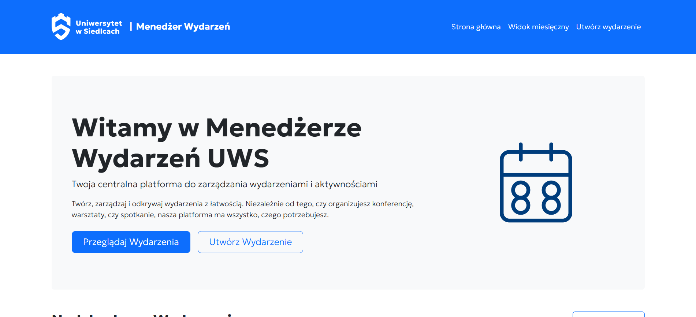
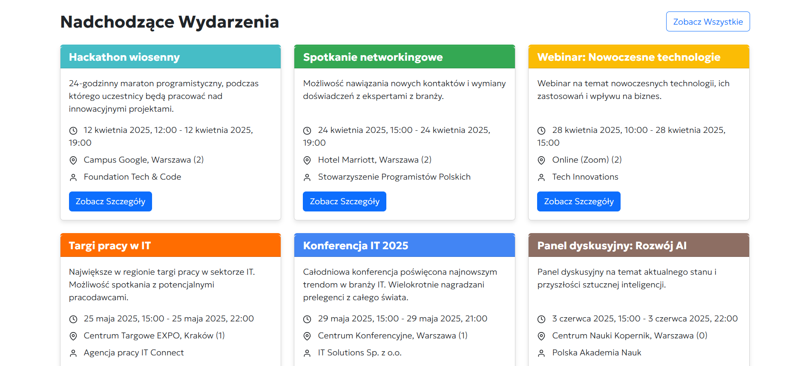
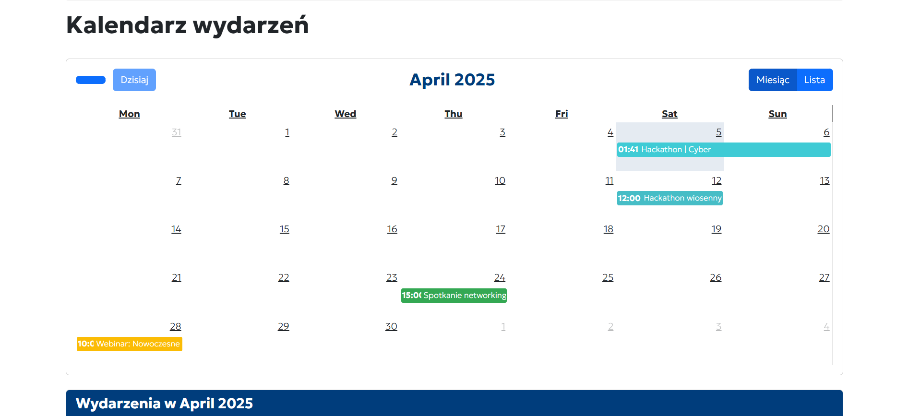
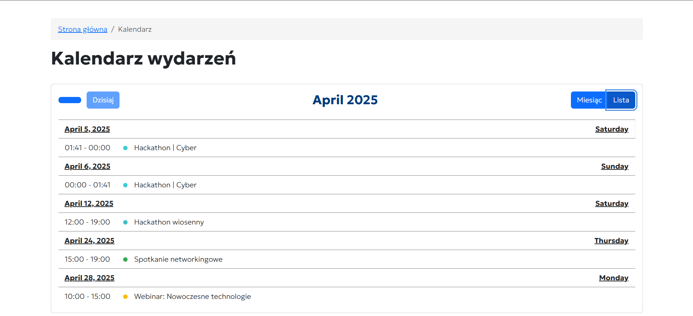
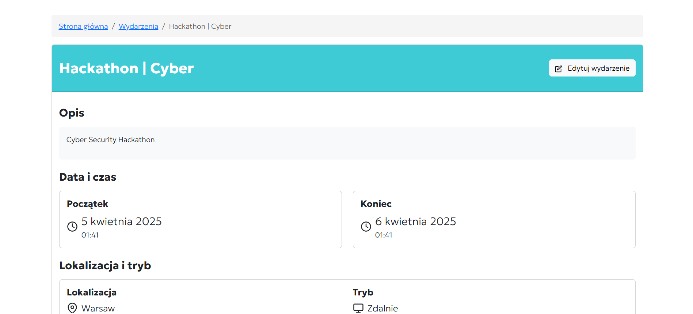
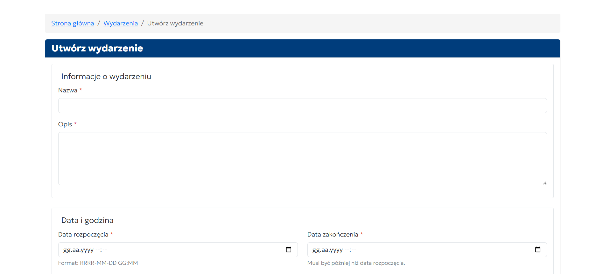
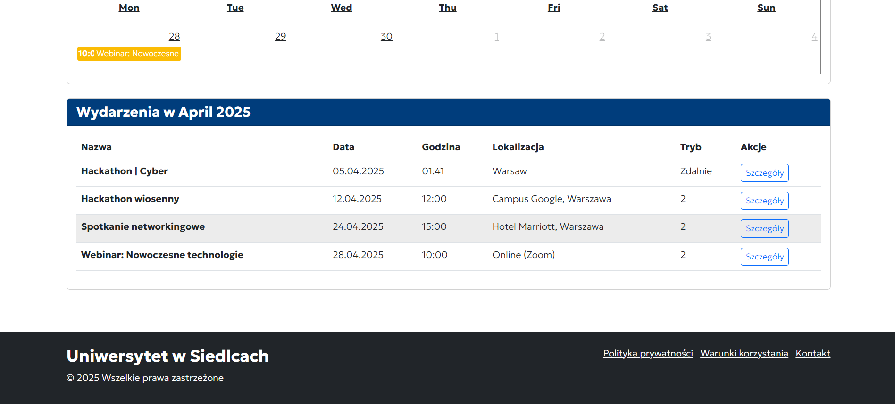
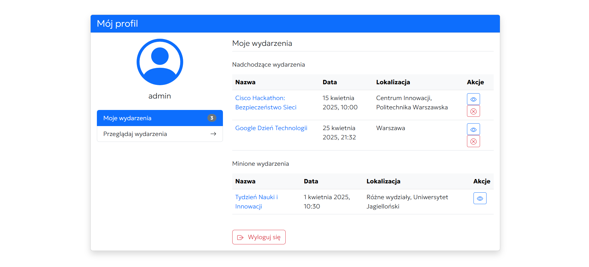

# Menedżer Wydarzeń Uniwersytetu w Siedlcach

## O projekcie

Menedżer Wydarzeń UWS to aplikacja internetowa stworzona dla Uniwersytetu w Siedlcach, umożliwiająca organizację, zarządzanie i promocję wydarzeń uczelnianych. Aplikacja została zaprojektowana z myślą o łatwości użytkowania, dostępności oraz zgodności z wytycznymi identyfikacji wizualnej UWS.

## Funkcjonalności

- **Przeglądanie wydarzeń** - lista nadchodzących wydarzeń na stronie głównej
- **Szczegóły wydarzeń** - pełne informacje o każdym wydarzeniu
- **Widok miesięczny** - kalendarz z zaplanowanymi wydarzeniami
- **Tworzenie wydarzeń** - formularz do dodawania nowych wydarzeń
- **Edycja wydarzeń** - możliwość aktualizacji informacji o wydarzeniach
- **Polskie tłumaczenie** - pełne wsparcie dla języka polskiego
- **Responsywny design** - dostosowanie do urządzeń mobilnych i desktopowych

## Technologie

- Django 5.2
- Bootstrap 5.3
- JavaScript
- HTML5 / CSS3
- SQLite (baza danych)
- Wsparcie dla i18n (internacjonalizacji)

## Instalacja

1. Sklonuj repozytorium:
   ```
   git clone https://github.com/cnnsyhnx/rekrutacja-front-django-04-2025.git
   cd rekrutacja-front-django-04-2025
   ```

2. Zainstaluj wymagane zależności:
   ```
   pip install -r requirements.txt
   ```

3. Zastosuj migracje:
   ```
   python manage.py migrate
   ```

4. Uruchom serwer deweloperski:
   ```
   python manage.py runserver
   ```

5. Otwórz przeglądarkę i przejdź do adresu `http://127.0.0.1:8000/`

## Struktura projektu

- `event_manager/` - Główny projekt Django
- `events/` - Aplikacja Django zarządzająca wydarzeniami
- `templates/` - Szablony HTML
- `static/` - Pliki statyczne (CSS, JavaScript, obrazy)
- `locale/` - Pliki tłumaczeń

## Zrzuty ekranu


*Strona główna z listą wydarzeń*


*Umożliwia wyświetlanie zaplanowanych wydarzeń na ekranie głównym.*


*Kalendarz z widokiem miesięcznym*


*Umożliwia wyświetlanie zdarzeń w formacie listy*


*Strona ze szczegółami wydarzenia*


*Formularz do tworzenia/edycji wydarzeń*


*Umożliwia wyświetlanie wydarzeń z bieżącego miesiąca*

  
*Panel profilu, który umożliwia użytkownikowi przeglądanie swoich przyszłych i minionych wydarzeń, a także zarządzanie nimi oraz wylogowanie się z systemu.*


## Autorzy

Projekt został opracowany dla Uniwersytetu w Siedlcach.

## Licencja

© 2025 Uniwersytet w Siedlcach. Wszelkie prawa zastrzeżone.